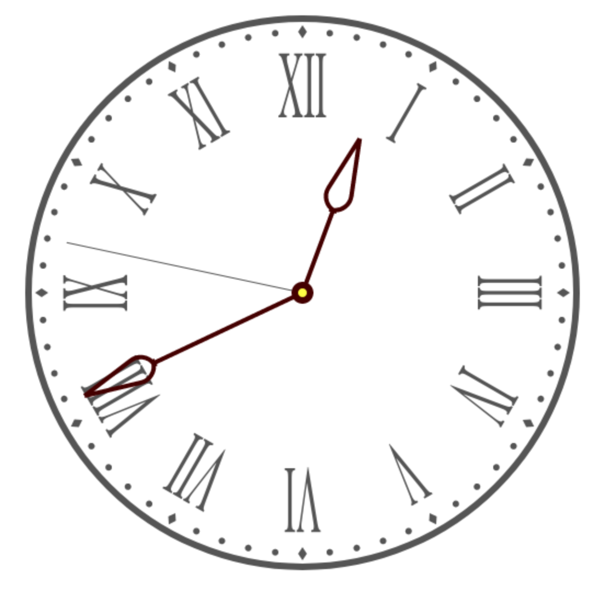

# Fable React DrawingCanvas

## Demo Apps

|  | [Real-time Analog Clock](https://davedawkins.github.io/Fable.React.DrawingCanvas/clock) |
|-|-|
|  | __[Interactive Koch Snowflake](https://davedawkins.github.io/Fable.React.DrawingCanvas/fractal)__ |
|  | __[20,000 Particles](https://davedawkins.github.io/Fable.React.DrawingCanvas/particles)__ |

## About

This is a Fable React wrapper for `canvas` that allows you to declare a drawing like this:

```fsharp
    open DrawingCanvas
    open DrawingCanvas.Builder

    div [] [
        drawingcanvas {
            Redraw = Drawing drawing {
                resize 400.00 400.0
                translate 200.0 200.0
                lineWidth 6.0
                beginPath
                arc 0.0 0.0 195.0 0.0 (2.0 * Math.PI) false
                stroke
            }
            Props = [ ]
        }
    ]
```

If you wish, you can supply a list of `DrawCommand` instead:

```fsharp
    open DrawingCanvas
    open DrawingCanvas.ListHelpers

    div [] [
        drawingcanvas {
            Redraw = Drawing [
                Resize (400.0, 400.0)
                Translate (200.0, 200.0)
                LineWidth 6.0
                BeginPath
                Arc (0.0, 0.0, 195.0, 0.0, (2.0 * Math.PI), false)
                Stroke
            ]
            Props = [ ]
        }
    ]
```

This demonstrates that `drawing { ... }` is just a builder that generates a `DrawCommand list`. Both approaches present their
challenges when it comes to control structures such as loops and conditionals.

One more option is to pass redraw function from which you may launch missiles if you wish (this is what all presentations about pure functions fear the most):

```fsharp
    open DrawingCanvas

    div [] [
        drawingcanvas {
            Redraw = DrawFunction (fun ctx ->
                ctx.canvas.width <- 400.0
                ctx.canvas.height <- 400.0
                ctx.translate(200.0, 200.0)
                ctx.lineWidth <- 6.0
                ctx.beginPath()
                ctx.arc (0.0, 0.0, 195.0, 0.0, (2.0 * Math.PI), false)
                ctx.stroke()
            )
            Props = [ ]
        }
    ]
```

The clock demo linked at the top of this page includes code to draw the clock in all three ways. See these files for comparison:

- `./app/ClockUsingBuilder.fs`
- `./app/ClockUsingFunction.fs`
- `./app/ClockUsingList.fs`


## Control Structures

This example comes from `ClockUsingBuilder.fs`.

```fsharp
    open DrawingCanvas
    open DrawingCanvas.Builder

    drawing {
        loop [ 0 .. 59 ] (fun i ->
            preserve {
                rotate (float i * pi / 30.0)
                translate 0. (-radius + 12.)
                beginPath

                ifThenElse (i % 5 = 0)
                    (lazy drawing {
                            moveTo  0.   6.
                            lineTo  4.0  0.0
                            lineTo  0.0 -6.0
                            lineTo -4.0  0.0
                            lineTo  0.0  6.0
                        }
                    )
                    (lazy drawing { arc 0. 0. 3. 0. (2. * pi) false })
                fill
            })
    }
```

| Term         | Explanation |
| ----         | ----------- |
| `drawing`    | Builds a plain old `DrawCommand list`  |
| `preserve`   | A `drawing` wrapped in `Save` and `Restore` |
| `loop`       | Collects all iterations of the given function over the given range, and inserts a flattened `DrawCommand list` into the current drawing |
| `ifThenElse` | Inserts one of the two given drawings according to the boolean selector |
|  --------    | The following aren't shown in the example:
| `ifThen`     | Inserts the drawing according to the boolean selector  |
| `strokepath` | A `drawing` wrapped in `BeginPath` and `Stroke` |
| `fillpath`   | A `drawing` wrapped in `BeginPath` and `Fill` |

Similar functions exist for building drawings as plain `DrawCommand list`, as seen in `ClockUsingList.fs`:

```fsharp
open DrawingCanvas
open DrawingCanvas.ListHelpers

let clockUsingList =
    // ...
    let marker i = preserve [
        Rotate( float i * pi / 30.0 )
        Translate( 0., -radius + 12. )
        BeginPath
        ifThenElse (i % 5 = 0)
            (lazy [
                MoveTo(0., 6.)
                LineTo(4.0, 0.0)
                LineTo(0.0, -6.0)
                LineTo(-4.0, 0.0)
                LineTo(0.0, 6.0)
            ])
            (lazy [ Arc( 0., 0., 3., 0., 2. * pi, false ) ])
        Fill
    ]
    // ...
    [
        // Outside border
        preserve [
            LineWidth 6.0
            BeginPath
            Arc ( 0., 0., radius, 0., angle 1.0, false )
            Stroke
        ] |> Insert

        // Numbers
        loop [0 .. 11] numeral

        // Markers
        loop [0 .. 59] marker
```

Note the use of `lazy` on conditionals to prevent eager evaluation of drawings that will not be used.

## Motivation

This component was inspired by Maxime Mangel's [Elmish.Canvas](https://github.com/MangelMaxime/Elmish.Canvas). I created this component as a learning exercise mainly. I wanted to see if I could derive the React component entirely in Fable, and I also wanted to see how the drawing syntax would look as a Computation Expression. This is my first attempt at a CE, and while it didn't turn out as neatly as I wanted, I'm pleased that it works. I like how the CE variant removes tuple-form arguments, for example.

## Issues

- The CE implementation is a lot of wrapper code around the DU, and I'm not sure how much value it adds. I didn't quite get the clean `for` and `if/then/else` constructs that I wanted, and from what I can tell, that's down to the use of `CustomExpression`. On the other hand, I'm very new to this, and I might be missing something. There's probably a good reason Maxime didn't go down this route.

- I like that the CE and DU represent pure approaches to specifying the drawing, but I'm not 100% sure I'm following the React rules in executing the drawing. From what I can tell, you can do it during `componentDidMount` and `componentDidUpdate`, provided you have captured a reference to the DOM canvas using `Ref`.

- Incomplete. See `API Coverage` below

- Documentation. No docs yet

## API Coverage

| ? | API Member |
|-----|------------|
|   | canvas |
|   | currentTransform |
|   | direction |
| ✓ | fillStyle |
|   | filter |
| ✓ | font |
|   | globalAlpha |
|   | globalCompositeOperation |
|   | imageSmoothingEnabled |
|   | imageSmoothingQuality |
| ✓ | lineCap |
| ✓ | lineDashOffset |
| ✓ | lineJoin |
| ✓ | lineWidth |
| ✓ | miterLimit |
| ✓ | shadowBlur |
| ✓ | shadowColor |
| ✓ | shadowOffsetX |
| ✓ | shadowOffsetY |
| ✓ | strokeStyle |
| ✓ | textAlign |
| ✓ | textBaseline |
|   | addHitRegion() |
| ✓ | arc() |
| ✓ | arcTo() |
| ✓ | beginPath() |
|   | bezierCurveTo() |
|   | clearHitRegions() |
| ✓ | clearRect() |
|   | clip() |
|   | closePath() |
|   | createImageData() |
|   | createLinearGradient() |
|   | createPattern() |
|   | createRadialGradient() |
|   | drawFocusIfNeeded() |
|   | drawImage() |
|   | drawWidgetAsOnScreen() |
|   | drawWindow() |
|   | ellipse() |
| ✓ | fill() |
| ✓ | fillRect() |
| ✓ | fillText() |
|   | getImageData() |
|   | getLineDash() |
|   | getTransform() |
|   | isPointInPath() |
|   | isPointInStroke() |
| ✓ | lineTo() |
|   | measureText() |
| ✓ | moveTo() |
|   | putImageData() |
|   | quadraticCurveTo() |
| ✓ | rect() |
|   | removeHitRegion() |
|   | resetTransform() |
| ✓ | restore() |
| ✓ | rotate() |
| ✓ | save() |
| ✓ | scale() |
|   | scrollPathIntoView() |
| ✓ | setLineDash() |
|   | setTransform() |
| ✓ | stroke() |
| ✓ | strokeRect() |
| ✓ | strokeText() |
| ✓ | transform() |
| ✓ | translate() |

## Availability

I'd be happy to turn this into a Nuget package, add some documentation. I'm definitely going to use it for my own projects. Firstly, I want to rebuild [Wet Frank](http://www.wetfrank.com) in Fable with DrawingCanvas.


