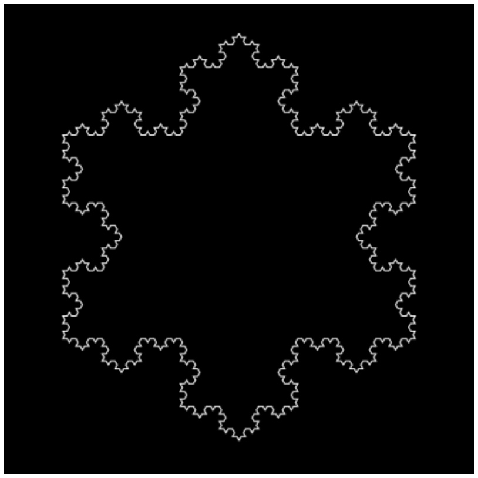
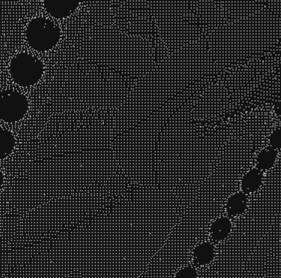
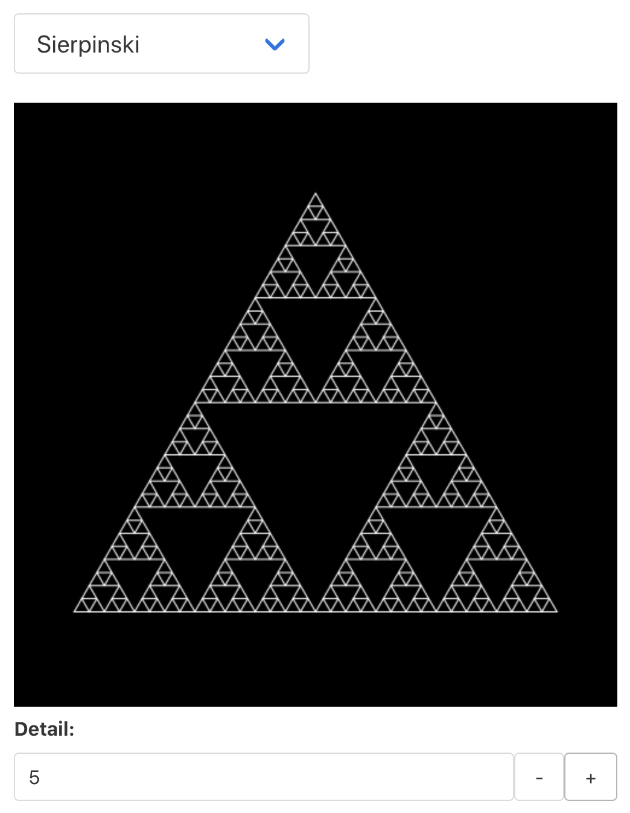

# Fable.React.DrawingCanvas [](https://www.nuget.org/packages/Fable.React.DrawingCanvas)

## Demo Apps

|  | [Real-time Analog Clock](https://davedawkins.github.io/Fable.React.DrawingCanvas/clock) |
|-|-|
|  | __[Interactive Koch Snowflake](https://davedawkins.github.io/Fable.React.DrawingCanvas/fractal)__ |
|  | __[20,000 Particles](https://davedawkins.github.io/Fable.React.DrawingCanvas/particles)__ |

## About

This is a Fable React wrapper for `canvas` that allows you to declare a drawing like this:

```fsharp
    open Fable.React.DrawingCanvas
    open Fable.React.DrawingCanvas.Builder

    div [] [
        drawingcanvas {
            Redraw = Drawing (drawing {
                resize 400.00 400.0
                translate 200.0 200.0
                lineWidth 6.0
                beginPath
                arc 0.0 0.0 195.0 0.0 (2.0 * Math.PI) false
                stroke
            }
            Props = [ ]
        })
    ]
```

One more option is to pass redraw function from which you may launch missiles if you wish (this is what all presentations about pure functions fear the most):

```fsharp
    open Fable.React.DrawingCanvas

    div [] [
        drawingcanvas {
            Redraw = DrawFunction (fun ctx ->
                ctx.canvas.width <- 400.0
                ctx.canvas.height <- 400.0
                ctx.translate(200.0, 200.0)
                ctx.lineWidth <- 6.0
                ctx.beginPath()
                ctx.arc (0.0, 0.0, 195.0, 0.0, (2.0 * Math.PI), false)
                ctx.stroke()
            )
            Props = [ ]
        }
    ]
```

The clock demo linked at the top of this page includes code to draw the clock in both ways. See these files for comparison:

- `./app/ClockUsingBuilder.fs`
- `./app/ClockUsingFunction.fs`


## Control Structures

This example comes from `ClockUsingBuilder.fs`.

```fsharp
    open Fable.React.DrawingCanvas
    open Fable.React.DrawingCanvas.Builder

    drawing {
        repeat [ 0 .. 59 ] (fun i ->
            preserve {
                rotate (float i * pi / 30.0)
                translate 0. (-radius + 12.)
                beginPath

                ifThenElse (i % 5 = 0)
                    (drawing {
                            moveTo  0.   6.
                            lineTo  4.0  0.0
                            lineTo  0.0 -6.0
                            lineTo -4.0  0.0
                            lineTo  0.0  6.0
                        }
                    )
                    (drawing { arc 0. 0. 3. 0. (2. * pi) false })
                fill
            })
    }
```

| Term         | Explanation |
| ----         | ----------- |
| `drawing`    | Builds a plain old `DrawCommand list`  |
| `preserve`   | A `drawing` wrapped in `Save` and `Restore` |
| `repeat`     | Collects all iterations of the given function over the given range, and inserts a flattened `DrawCommand list` into the current drawing |
| `ifThenElse` | Inserts one of the two given drawings according to the boolean selector |
|  --------    | The following aren't shown in the example:
| `ifThen`     | Inserts the drawing according to the boolean selector  |
| `strokepath` | A `drawing` wrapped in `BeginPath` and `Stroke` |
| `fillpath`   | A `drawing` wrapped in `BeginPath` and `Fill` |
| `sub` d      | Include the sub-drawing d at this point. This is how you include drawings from functions


The type of `drawing { }` is now `unit -> Drawing`. This allowed the removal of the `lazy` keyword used in the previous release.

The type `Drawing` is aliased to `DrawCommand list`.

## Turtle Graphics

You can also build drawings using turtle graphics. The `Fractal` demo is now implemented purely in terms of `turtle { .. }`.



The type of `turtle { }` is `unit ->Drawing`.

Supported commands are

| Command             | Description  |
|---------------------|--------------|
| `penDown`           | Set pen down |
| `penUp`             | Set pen up   |
| `penColor c`        | Set pen colour |
| `forward n`         | Move forward distance n. A line will be drawn if the pen is down |
| `turn a`            | Turn by a degrees |
| `ifThen d`          | Conditional sub turtle drawing |
| `ifThenElse d1 d2`  | Alternate sub turtle drawings |
| `repeat seq<T> f`   | Repeated sub turtle drawing returned from function f. Type of f is `T -> (unit -> Drawing)`|
| `sub` d             | Include the sub-drawing d at this point. This is how you include drawings from functions

More commands are on their way.

Examples that draw squares:
```fsharp

    // Long-hand
    turtle {
        penDown
        penColor "red"
        forward 100
        turn 90
        forward 100
        turn 90
        forward 100
        turn 90
        forward 100
        turn 90
    }

    // Using repeat + lambda
    turtle {
        penDown
        penColor "red"
        repeat [1..4] (fun _ -> turtle {
            forward 100
            turn 90
        })
    }

    // Using repeat + function (note iteration variable i)
    let side d i = turtle { forward d; turn 90 }

    turtle {
        penDown
        penColor "red"
        repeat [1..4] (side 100)
    }

    // Unrolled loop with function
    let side d = turtle { forward d; turn 90 }

    turtle {
        penDown
        penColor "red"
        sub (side 100)
        sub (side 100)
        sub (side 100)
        sub (side 100)
    }

```

## Motivation

This component was inspired by Maxime Mangel's [Elmish.Canvas](https://github.com/MangelMaxime/Elmish.Canvas). I created this component as a learning exercise mainly. I wanted to see if I could derive the React component entirely in Fable, and I also wanted to see how the drawing syntax would look as a Computation Expression. This is my first attempt at a CE, and while it didn't turn out as neatly as I wanted, I'm pleased that it works. I like how the CE variant removes tuple-form arguments, for example.

Inspiration for using `Custom Expressions` for computation expressions came from seeing how Isaac Abraham's [Farmer](https://github.com/CompositionalIT/farmer) implements its builders (such as `webApp`, `arm` etc).

## API Coverage

| ? | API Member |
|-----|------------|
|   | canvas |
|   | currentTransform |
|   | direction |
| ✓ | fillStyle |
|   | filter |
| ✓ | font |
|   | globalAlpha |
|   | globalCompositeOperation |
|   | imageSmoothingEnabled |
|   | imageSmoothingQuality |
| ✓ | lineCap |
| ✓ | lineDashOffset |
| ✓ | lineJoin |
| ✓ | lineWidth |
| ✓ | miterLimit |
| ✓ | shadowBlur |
| ✓ | shadowColor |
| ✓ | shadowOffsetX |
| ✓ | shadowOffsetY |
| ✓ | strokeStyle |
| ✓ | textAlign |
| ✓ | textBaseline |
|   | addHitRegion() |
| ✓ | arc() |
| ✓ | arcTo() |
| ✓ | beginPath() |
|   | bezierCurveTo() |
|   | clearHitRegions() |
| ✓ | clearRect() |
|   | clip() |
|   | closePath() |
|   | createImageData() |
|   | createLinearGradient() |
|   | createPattern() |
|   | createRadialGradient() |
|   | drawFocusIfNeeded() |
|   | drawImage() |
|   | drawWidgetAsOnScreen() |
|   | drawWindow() |
|   | ellipse() |
| ✓ | fill() |
| ✓ | fillRect() |
| ✓ | fillText() |
|   | getImageData() |
|   | getLineDash() |
|   | getTransform() |
|   | isPointInPath() |
|   | isPointInStroke() |
| ✓ | lineTo() |
|   | measureText() |
| ✓ | moveTo() |
|   | putImageData() |
|   | quadraticCurveTo() |
| ✓ | rect() |
|   | removeHitRegion() |
|   | resetTransform() |
| ✓ | restore() |
| ✓ | rotate() |
| ✓ | save() |
| ✓ | scale() |
|   | scrollPathIntoView() |
| ✓ | setLineDash() |
|   | setTransform() |
| ✓ | stroke() |
| ✓ | strokeRect() |
| ✓ | strokeText() |
| ✓ | transform() |
| ✓ | translate() |

## Availability
Available from NuGet as `Fable.React.DrawingCanvas`.

## Revision History

*1.1*
- Basic turtle support
- Builders return (unit -> Drawing) so we can drop need for `lazy`
- Renamed `loop` to `repeat`
- Renamed `insert` to `sub`
- More unit tests
- Focus more on usability of builders than plain lists, though still supported, they don't look as neat

*1.0.1*
- Module name "DrawingCanvas" -> "Fable.React.DrawingCanvas"
- Update README
- It's a breaking change, but I'm not going to bump the major
until the API is a little more complete and I've got more testing done.

----------

*1.0.0*
- Initial release

